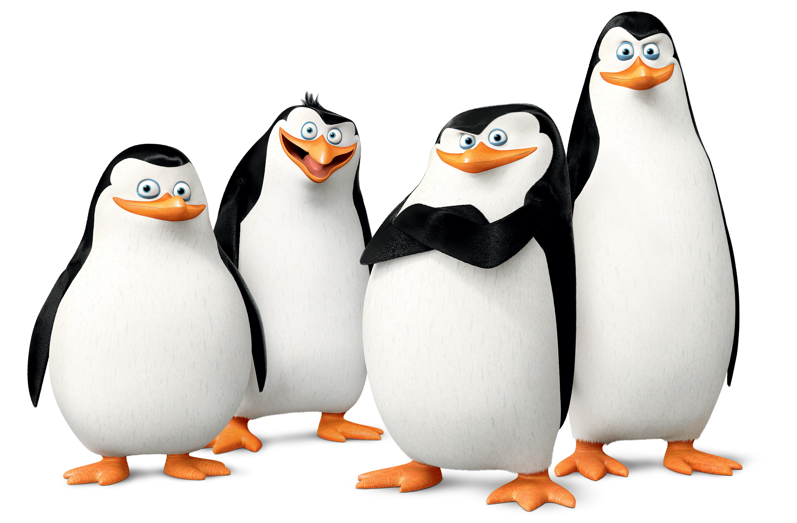
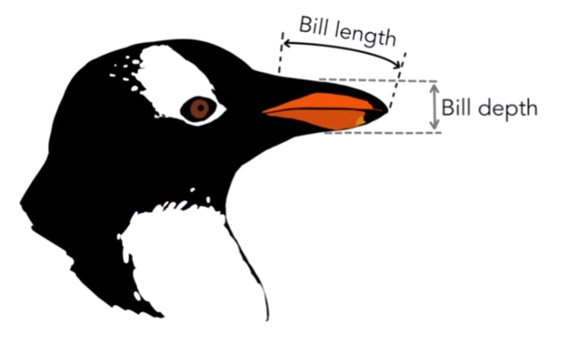
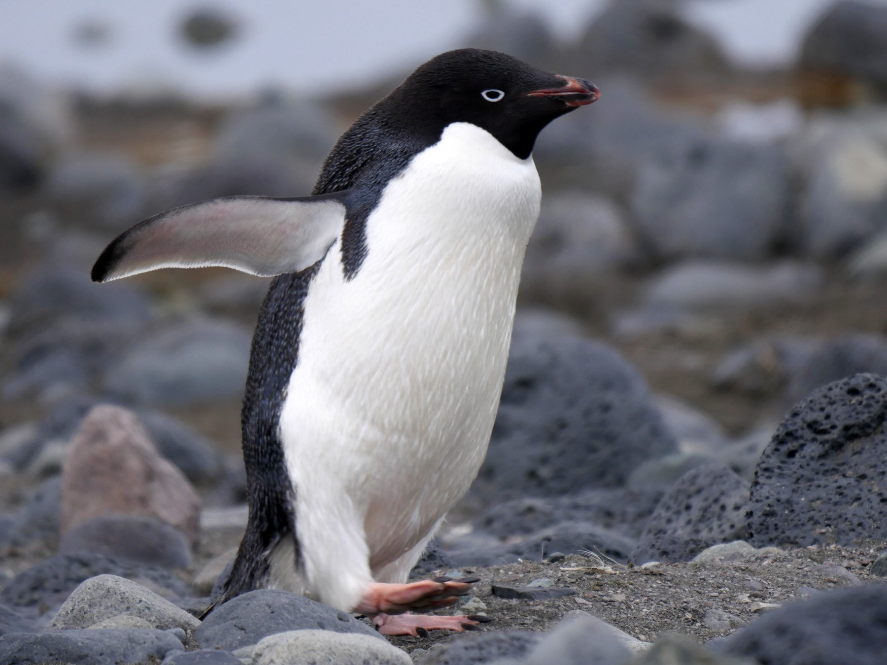
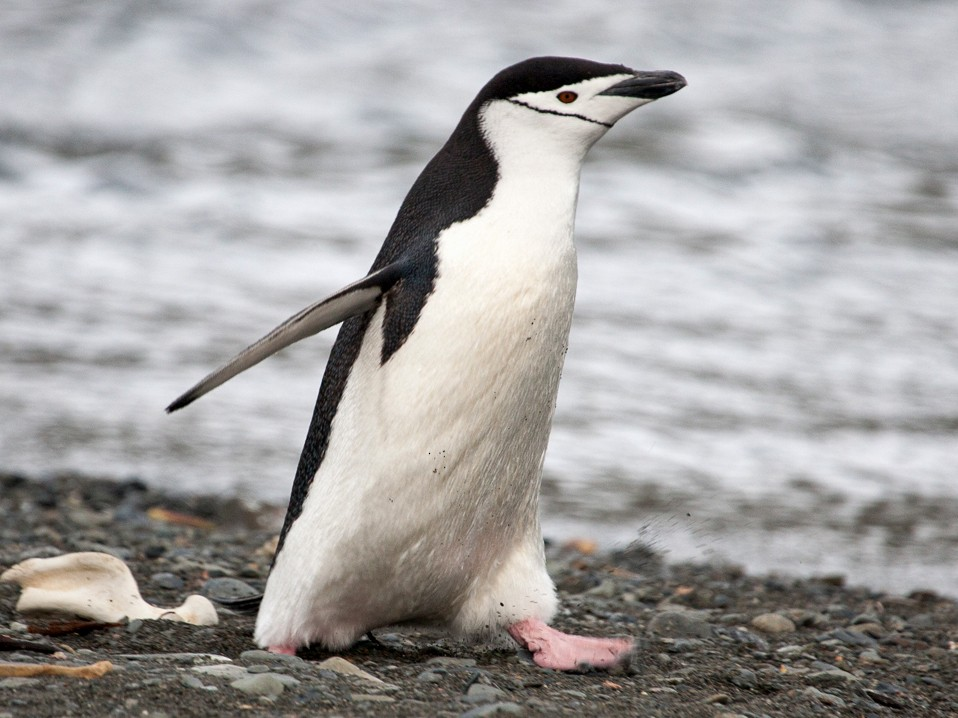
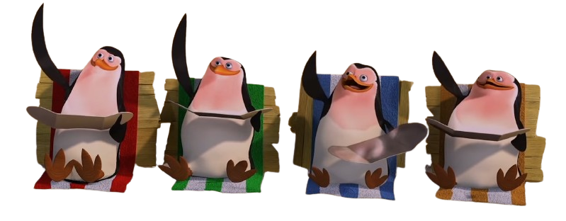

```{r libraries, include=FALSE, warning=FALSE}

library(readr)
library(dplyr)
library(gridExtra)
library(patchwork)
library(ggplot2)
library(magick)
library(tidyr)
library(kableExtra)
library(htmlwidgets)
library(leaflet)
```

```{r setting_vars, include=FALSE, warning=FALSE}
# DOCUMENTAÇÃO DO QUARTO https://quarto.org/docs/presentations/revealjs/

#Carregando o Data Base Penguins:
penguins_db <- read_csv("../data/penguins.csv")

# Header para tabelas knit do database original
penguins_db_header <- c("Index", "Specie",
                        "Island", "Bill Length (mm)",
                        "Bill Depth (mm)", "Flipper Length (mm)",
                        "Body Mass (g)", "Sex", "Year")

#Criando um subset para cada espécie:
species_unique <- unique(penguins_db$species)
islands_unique <- unique(penguins_db$island)
nrows_species <- c()
nrows_species_male <- c()
nrows_species_female <- c()

for (spec in species_unique) {
  # Banco de dados
  subset_name <- paste("species_separadas_", tolower(spec), sep = "")
  assign(subset_name, penguins_db[penguins_db$species == spec, ])
  # Número de registros por espécie
  nrows_name <- paste("nrows_", tolower(spec), sep = "")
  assign(nrows_name, nrow(penguins_db[penguins_db$species == spec, ]))

  nrows_species <- c(nrows_species,
                     nrow(penguins_db[penguins_db$species == spec, ]))

  nrows_species_male <- c(nrows_species_male,
                          nrow(penguins_db[penguins_db$species == spec &
                                             penguins_db$sex == "male", ]))

  nrows_species_female <- c(nrows_species_female,
                            nrow(penguins_db[penguins_db$species == spec &
                                               penguins_db$sex == "female", ]))
}

media_adelie <- colMeans(species_separadas_adelie[c("bill_length_mm", "bill_depth_mm", "flipper_length_mm", "body_mass_g")], na.rm = TRUE)
media_chinstrap <- colMeans(species_separadas_chinstrap[c("bill_length_mm", "bill_depth_mm", "flipper_length_mm", "body_mass_g")], na.rm = TRUE)
media_gentoo <- colMeans(species_separadas_gentoo[c("bill_length_mm", "bill_depth_mm", "flipper_length_mm", "body_mass_g")], na.rm = TRUE)

```
# Introdução

## Sobre o Dataset 

::: columns
::: {.column width="55%"}
- Além de um banco de dados no Kaggle, é um banco de dados "verdadeiro" e nativo do R

- Os dados foram coletados e disponibilizados pela Dra. Kristen Gorman e pela Estação Palmer, Antártica, LTER (Long Term Ecological Research), membro da Rede de Pesquisa Ecológica de Longo Prazo.

- 344 Pinguins

- 3 espécies (Adélie, chinstrap e gentoo)
:::

::: {.column width="45%"}
{.absolute  width="400" height="400"}

:::
:::

## Contexto

::: columns
::: {.column width="55%"}

- Coletados em Palmer Station, na Península Antártica, esses dados oferecem insights valiosos sobre três espécies de pinguins: Adélie, Chinstrap e Gentoo. 
- Cada linha neste conjunto de dados é mais do que um simples registro; é uma história de sobrevivência, reprodução e evolução em um dos ambientes mais extremos do planeta.
:::

::: {.column width="45%"}
{.absolute  width="450" height="300"}
:::
:::

## Apresentando o dataset

::: columns
::: {.column width="62%"}
Exemplo de uma pequena amostra aleatória do dataset:

```{r penguinsdb_sample}

knitr::kable(na.omit(penguins_db)[sample(nrow(na.omit(penguins_db)), 8), 2:ncol(penguins_db)],
  col.names = penguins_db_header[-1],
  align = "ccrrrrcc"
)  %>%
  kable_styling(full_width = F, font_size = 17)
   
```
:::
::: {.column width="38%"}

{.absolute  width="380" height="auto"}

:::
:::

## Nossos Protagonistas

::: columns
::: {.column width="33%" .fragment}
- Adélie 
 {width="290" height="auto"}
 
```{r}

knitr::kable(media_adelie, 
      col.names = "Médias") %>%
  kable_styling(full_width = F, position = "center", font_size = 18)
```
:::

::: {.column width="33%" .fragment}
- Chinstrap
 {width="290" height="auto"}
 
```{r attr.output='.incremental'}

knitr::kable(media_chinstrap, 
      col.names = "Médias") %>%
  kable_styling(full_width = F, position = "center", font_size = 18)
```

:::

::: {.column width="33%" .fragment}
- Gentoo
 {width="290" height="auto"}
 
```{r attr.output='.incremental'}

knitr::kable(media_gentoo, 
      col.names = "Médias") %>%
  kable_styling(full_width = F, position = "center", font_size = 18)
```

:::
:::
## Sobre as espécies
::: {.panel-tabset}

### Visão Geográfica
```{r geo_map}

leaflet() %>%
  addTiles() %>%  # Add default OpenStreetMap map tiles
  addMarkers(lng=-65.5000, lat=-65.4333, popup="Biscoe Island") %>%
  addMarkers(lng=-64.2333 , lat=-64.7333, popup="Dream Island") %>%
  addMarkers(lng=-64.083333, lat=-64.7666636, popup="Torgersen Island") %>%
  addProviderTiles("Esri.WorldImagery")

```

### Ocupação

```{r habitat}

penguis_island_presence <- penguins_db %>%
  group_by(species, island) %>%
  summarise(contagem = n(), .groups = "drop")

ggplot(penguis_island_presence, aes(x=island, y=species, fill = contagem)) +
  geom_tile() + 
  geom_text(aes(label = contagem), color = "white", size = 4) + 
  labs(x = "",
       y = "") + 
  theme_bw() + 
  theme(plot.background = element_rect(fill = "#fcfbf9"),
        legend.background = element_rect(fill = "#fcfbf9"),
        panel.background = element_rect(fill = "#fcfbf9"),
        legend.key = element_rect(fill = "#fcfbf9"),
        panel.border = element_rect(fill = "NA", color = "#fcfbf9"),
        plot.margin = margin(0,0,0,0))

```

### Observações

::: columns
::: {.column width="70%"}
```{r species_resum_min_max}

species_resum <- penguins_db %>%
  group_by(species) %>%
  summarize(nrows_species = n(),
    male_count = sum(ifelse(sex == "male", 1, 0), na.rm = TRUE),
    female_count = sum(ifelse(sex == "female", 1, 0), na.rm = TRUE),
    bill_length_min = min(bill_length_mm, na.rm = TRUE),
    bill_length_max = max(bill_length_mm, na.rm = TRUE),
    bill_depth_min = min(bill_depth_mm, na.rm = TRUE),
    bill_depth_max = max(bill_depth_mm, na.rm = TRUE),
    flipper_length_min = min(flipper_length_mm, na.rm = TRUE),
    flipper_length_max = max(flipper_length_mm, na.rm = TRUE),
    body_mass_min = min(body_mass_g, na.rm = TRUE),
    body_mass_max = max(body_mass_g, na.rm = TRUE),
  ) %>%
  rename(
    "Total de registros" = nrows_species,
    "Quant. de machos" = male_count,
    "Quant. de fêmeas" = female_count,
    "Menor comprimento do bico (mm)" = bill_length_min,
    "Maior comprimento do bico (mm)" = bill_length_max,
    "Menor profundidade do bico (mm)" = bill_depth_min,
    "Maior profundidade do bico (mm)" = bill_depth_max,
    "Menor comprimento da nadadeira (mm)" = flipper_length_min,
    "Maior comprimento da nadadeira (mm)" = flipper_length_max,
    "Menor massa corporal (g)" = body_mass_min,
    "Maior massa corporal (g)" = body_mass_max
  )

knitr::kable(t(species_resum[, 2:ncol(species_resum)]),
             col.names = c(species_resum$species)) %>%
  kable_styling(font_size = 17.5)
 
```
:::
::: {.column width="30%"}

{width="100%" height="auto"}

:::
:::
### Proporções Físicas 

Relação entre comprimento da nadadeira e massa corporal
```{r body_mass_flipper}

ggplot(data=penguins_db,aes(x=flipper_length_mm,y=body_mass_g)) +
  geom_point(aes(shape=species,color=species), size = 2) + 
  labs(x = "Comprimento da nadadeira (mm)",
       y = "Massa Corporal (g)") + 
  theme_bw() + 
  theme(plot.background = element_rect(fill = "#fcfbf9"),
        legend.background = element_rect(fill = "#fcfbf9"),
        panel.background = element_rect(fill = "#fcfbf9"),
        legend.key = element_rect(fill = "#fcfbf9"),
        panel.border = element_rect(fill = "NA", color = "#fcfbf9"),
        plot.margin = margin(0,0,0,0),
        text = element_text(size = 12))
 
ggplot(data=subset(penguins_db, sex %in% c("male", "female")))+
  geom_point(mapping=aes(x=flipper_length_mm, y=body_mass_g, color=species,shape=species))+
  labs(x = "Comprimento da nadadeira (mm)",
       y = "Massa Corporal (g)") + 
  facet_wrap(~sex) + 
  theme_bw()+ 
  theme(plot.background = element_rect(fill = "#fcfbf9"),
        legend.background = element_rect(fill = "#fcfbf9"),
        panel.background = element_rect(fill = "#fcfbf9"),
        legend.key = element_rect(fill = "#fcfbf9"),
        panel.border = element_rect(fill = "NA", color = "#fcfbf9"),
        plot.margin = margin(0,0,0,0),
        text = element_text(size = 12))

```

Comparação da distribuição da massa corporal por espécie
```{r boxplot}

ggplot(penguins_db, aes(x = species, y = body_mass_g, fill = species)) +
  geom_boxplot() +
  labs(x = "Espécie",
       y = "Massa (g)") +
  theme_bw() + 
  theme(plot.background = element_rect(fill = "#fcfbf9"),
        legend.background = element_rect(fill = "#fcfbf9"),
        panel.background = element_rect(fill = "#fcfbf9"),
        legend.key = element_rect(fill = "#fcfbf9"),
        panel.border = element_rect(fill = "NA", color = "#fcfbf9"),
        plot.margin = margin(0,0,0,0),
        text = element_text(size = 12))

```

Relação entre comprimento e profundidade do bico
```{r bill_lenght_depth}

ggplot(data=penguins_db,aes(x=bill_length_mm,y=bill_depth_mm)) +
  geom_point(aes(shape=species,color=species), size = 2) +
  labs(x = "Comprimento do bico (mm)",
       y = "Profundidade do bico (mm)") + 
  theme_bw() + 
  theme(plot.background = element_rect(fill = "#fcfbf9"),
        legend.background = element_rect(fill = "#fcfbf9"),
        panel.background = element_rect(fill = "#fcfbf9"),
        legend.key = element_rect(fill = "#fcfbf9"),
        panel.border = element_rect(fill = "NA", color = "#fcfbf9"),
        plot.margin = margin(0,0,0,0),
        text = element_text(size = 12))

ggplot(data=subset(penguins_db, sex %in% c("male", "female")))+
  geom_point(mapping=aes(x=bill_length_mm, y=bill_depth_mm, color=species,shape=species))+
  labs(x = "Comprimento do bico (mm)",
       y = "Profundidade do bico (mm)") + 
  facet_wrap(~sex) + 
  theme_bw()+ 
  theme(plot.background = element_rect(fill = "#fcfbf9"),
        legend.background = element_rect(fill = "#fcfbf9"),
        panel.background = element_rect(fill = "#fcfbf9"),
        legend.key = element_rect(fill = "#fcfbf9"),
        panel.border = element_rect(fill = "NA", color = "#fcfbf9"),
        plot.margin = margin(0,0,0,0),
        text = element_text(size = 12))

```

:::

# Pesquisas

## Estudo Adelie
Com o objetivo de cálcular o intervalo de confiança para a espécie Adelie, criamos um data base com apenas as observações da espécie de interesse nele, abaixo está o resumo:

::: {.panel-tabset}

### As primeiras 6 observações:

```{r Data Base Explicação, warning=FALSE}

knitr::kable(head(species_separadas_adelie[, 2:ncol(species_separadas_adelie)]),
  col.names = penguins_db_header[-1],
  align = "ccrrrrcc"
) %>%
  kable_styling(font_size = 20)

```

### Intervalo de confiança:

Histograma de amostras do comprimento da nadadeira (mm)

```{r Curva Teórica Explicação, warning=FALSE, message=FALSE}

set.seed(1234)

ggplot(data = data.frame(x = species_separadas_adelie$flipper_length_mm), aes(x = x)) +
  geom_histogram(color="#164863", fill="#427D9D") +
  labs(x = "Comprimento da Nadadeira (mm)",
       y = "Frequência") + 
  theme_bw()+ 
  theme(text = element_text(size = 12)) + 
  geom_text(x = 205, y = 18, label = "Limite Superior: 190.993 mm ", alpha = 0.03) +
  geom_text(x = 205, y = 16.5, label = "Limite Inferior: 188.914 mm ", alpha = 0.03) +
  theme(plot.background = element_rect(fill = "#fcfbf9"),
        legend.background = element_rect(fill = "#fcfbf9"),
        panel.background = element_rect(fill = "#fcfbf9"),
        legend.key = element_rect(fill = "#fcfbf9"),
        panel.border = element_rect(fill = "NA", color = "#fcfbf9"),
        plot.margin = margin(0,0,0,0))

```

::: footer
.
:::
:::

## IC (Com Bootstrap!)

O que é e como funciona:

{.r-stretch width="100%" height="auto"}

```{r, echo = FALSE, include=FALSE}

#O limite inferior feito com a fórmula é de:
#média da coluna comprimento do bico
media_adelie <- mean(species_separadas_adelie$flipper_length_mm, na.rm = TRUE)

# z <- qnorm(p = 0.025, mean = 0, sd = 1, lower.tail = FALSE) #Gerando Z-Score para 0.95 dos dados
z <- qnorm(0.025, lower.tail = FALSE)

# n <- length(species_separadas_adelie$species) #tamanho da amostra

n <- nrow(species_separadas_adelie)

sd_adelie <- sd(species_separadas_adelie$flipper_length_mm, na.rm = TRUE) #desvio padrão da amostra

#Gerando o limite Inferior pela fórmula:
lim_inf <- media_adelie - z * sd_adelie/sqrt(n)
lim_inf

#Gerando o limite Superior pela fórmula:
lim_sup <- media_adelie + z * sd_adelie/sqrt(n)

```

```{r Informações para Bootstraping, include=FALSE, warning=FALSE}

#Bootstraping para gerar curva teórica
n <- length(species_separadas_adelie$species) #tamanho da amostra

#repetições da amostra
n_repeticoes <- 10000

#vetor que armazena as repetições de amostras
repeticoes_media <- as.numeric(n_repeticoes)

for (i in 1:n_repeticoes) {
  amostra <- sample(species_separadas_adelie$flipper_length_mm,
                    size = n,
                    replace = TRUE)
  repeticoes_media[i] <- mean(amostra, na.rm = TRUE)
}

# Criando o dataframe
data <- data.frame(x = repeticoes_media)

#Limite Inferior Bootstrap
lim_inf_boot  <- qnorm(p = 0.025,
                       mean = mean(repeticoes_media),
                       sd = sd(repeticoes_media,
                       na.rm = TRUE))

#Limite Superior Bootstrap
lim_sup_boot  <- qnorm(p = 0.025,
                       mean = mean(repeticoes_media),
                       sd = sd(repeticoes_media, na.rm = TRUE),
                       lower.tail = FALSE)

# #Armazenando os limites Inferior e Superior:
# lim_inf <- media_adelie - z * sd_adelie/sqrt(n)
# lim_sup <- media_adelie + z * sd_adelie/sqrt(n)

```

## Na prática
::: {.panel-tabset}

### Intervalo Bootstraping

Histograma das médias geradas pelo BootStraping com Curva Teórica

```{r Intervalo de Confiança,warning=FALSE}

ggplot(data = data, aes(x = x)) +
  geom_histogram(aes(y = after_stat(density)),
  fill = "#FC9E21",
  binwidth = 0.1,
  color = "black") +
  stat_function(fun = dnorm,
                args = list(mean = mean(data$x, na.rm = TRUE), 
                            sd = sd(data$x, na.rm = TRUE)),
                color = "#100818",
                size = 1) +
  theme_bw() +
  labs(title = "Espécie Adelie considerando o comprimento da nadadeira",
       x = "Comprimento da Nadadeira (mm)",
       y = "Densidade",
       fill = "Distribuição") +
  theme(plot.background = element_rect(fill = "#fcfbf9"),
        legend.background = element_rect(fill = "#fcfbf9"),
        panel.background = element_rect(fill = "#fcfbf9"),
        legend.key = element_rect(fill = "#fcfbf9"),
        panel.border = element_rect(fill = "NA", color = "#fcfbf9"),
        plot.margin = margin(0,0,0,0))

```


### IC - Curva Teórica
Verifica-se a curva normal teórica com o IC calculado na curva teórica!

```{r Intervalo com Curva Teórica, warning=FALSE}
#Intervalo de Confiança na curva teórica
ggplot(data = data, aes(x = x)) +
  stat_function(fun = dnorm,
                args = list(mean = mean(data$x, na.rm = TRUE),
                            sd = sd(data$x, na.rm = TRUE)),
                color = "#100818", size = 1) +
  stat_function(fun = dnorm,
                args = list(mean = mean(data$x, na.rm = TRUE),
                            sd = sd(data$x, na.rm = TRUE)),
                geom = "area", fill = "blue",
                alpha = 0.2,
                xlim = c(188, lim_inf)) +
  stat_function(fun = dnorm,
                args = list(mean = mean(data$x, na.rm = TRUE),
                            sd = sd(data$x, na.rm = TRUE)),
                geom = "area", fill = "blue",
                alpha = 0.2,
                xlim = c(lim_sup, 192)) +
  theme_bw() +
  labs(title = "Curva Normal das Médias Geradas pelo BootStraping considerando IC",
       subtitle = "Para espécie Adélie considerando o comprimento da nadadeira",
       x = "Comprimento da Nadadeira (mm)",
       y = "Densidade",
       fill = "Distribuição") +
  geom_text(x = 191.5, y = 0.7, label = "Limite Inferior: 188.9 mm\nLimite Superior: 190.9 mm ", alpha = 0.03) +
  theme(plot.background = element_rect(fill = "#fcfbf9"),
        legend.background = element_rect(fill = "#fcfbf9"),
        panel.background = element_rect(fill = "#fcfbf9"),
        legend.key = element_rect(fill = "#fcfbf9"),
        panel.border = element_rect(fill = "NA", color = "#fcfbf9"),
        plot.margin = margin(0,0,0,0))

```
Logo, um intervalo de confiança com um nível de confiança de 95% indica que, em teoria, se selecionássemos uma amostra de mesmo tamanho de uma mesma população muitas vezes e calculássemos o intervalo de confiança para cada uma delas, aproximadamente 95% desses intervalos incluiriam o verdadeiro valor do parâmetro.

### Comparação
Verifica-se que os intervalos de confiança com fórmula 'tradicional' e com Bootstrap são praticamente os mesmos:

```{r Comparação, echo = FALSE, warning=FALSE}

comp_table <- matrix(c(lim_inf, lim_inf_boot, lim_sup, lim_sup_boot),
                     nrow = 2, byrow = TRUE)

colnames(comp_table) <- c("Fórmula", "Bootstrap")
rownames(comp_table) <- c("Limite Inferior", "Limite Sperior")


knitr::kable(comp_table,
             align = "crr")

```

:::

## Gentoo e Chinstrap!
::: {.panel-tabset}

### Ánalise Gentoo

```{r Todas, warning=FALSE}
#Análise de todas juntas

#Por fim a espécie 	Chinstrap

species_separadas_chinstrap <- penguins_db %>%
  filter(species == "Chinstrap")

n_repeticoes <- 10000 #número de repetições de amostras
repeticoes_media_chinstrap <- as.numeric(n_repeticoes) #vetor que armazena as repetições de amostras
for (i in 1:n_repeticoes) {
  amostra <- sample(species_separadas_chinstrap$flipper_length_mm, size = n, replace = TRUE)
  repeticoes_media_chinstrap[i] <- mean(amostra, na.rm = TRUE)
}

lim_inf_boot_chinstrap  <- qnorm(p = 0.025, mean = mean(repeticoes_media_chinstrap), sd = sd(repeticoes_media_chinstrap, na.rm = TRUE)) #Limite Inferior
lim_sup_boot_chinstrap  <- qnorm(p = 0.025, mean = mean(repeticoes_media_chinstrap), sd = sd(repeticoes_media_chinstrap, na.rm = TRUE), lower.tail = FALSE) #Limite Superior

#Para espécie Gentoo:

# Já foi feito esse banco
# species_separadas_gentoo <- penguins_db %>%
#   filter(species == "Gentoo")

#número de repetições de amostras
n_repeticoes <- 10000

#vetor que armazena as repetições de amostras
repeticoes_media_gentoo <- as.numeric(n_repeticoes)

for (i in 1:n_repeticoes) {
  amostra <- sample(species_separadas_gentoo$flipper_length_mm, 
                    size = n,
                    replace = TRUE)
  repeticoes_media_gentoo[i] <- mean(amostra, na.rm = TRUE)
}

# Limite Inferior
lim_inf_boot_gentoo <- qnorm(p = 0.025,
                             mean = mean(repeticoes_media_gentoo),
                             sd = sd(repeticoes_media_gentoo, na.rm = TRUE))

# Limite Superior
lim_sup_boot_gentoo <- qnorm(p = 0.025,
                             mean = mean(repeticoes_media_gentoo),
                             sd = sd(repeticoes_media_gentoo, na.rm = TRUE), 
                             lower.tail = FALSE)


#vetor que armazena as repetições de amostras
repeticoes_media_adelie <- as.numeric(n_repeticoes)

for (i in 1:n_repeticoes) {
  amostra <- sample(species_separadas_adelie$flipper_length_mm, 
                    size = n,
                    replace = TRUE)
  repeticoes_media_adelie[i] <- mean(amostra, na.rm = TRUE)
}

# Limite Inferior
lim_inf_boot_adelie <- qnorm(p = 0.025,
                             mean = mean(repeticoes_media_adelie),
                             sd = sd(repeticoes_media_adelie, na.rm = TRUE))

# Limite Superior
lim_sup_boot_adelie <- qnorm(p = 0.025,
                             mean = mean(repeticoes_media_adelie),
                             sd = sd(repeticoes_media_adelie, na.rm = TRUE), 
                             lower.tail = FALSE)

g3 <- ggplot(data = data.frame(x = repeticoes_media_gentoo), aes(x = x)) +
  geom_histogram(aes(y = after_stat(density)) ,
                binwidth = 0.1,
                fill = "#3E8F92",
                color = "black") +
  stat_function(fun = dnorm,
                args = list(mean = mean(repeticoes_media_gentoo, na.rm = TRUE), sd = sd(repeticoes_media_gentoo, na.rm = TRUE)),
                color = "black",
                size = 1
                ) +
  theme_bw() +
  labs(title = "Histograma das médias geradas pelo BootStraping",
      subtitle = "Para espécie Gentoo considerando a Variável Comprimento da Nadadeira",
      x = "Comprimento da Nadadeira (mm)",
      y = "Densidade") +
  theme(plot.background = element_rect(fill = "#fcfbf9"),
        legend.background = element_rect(fill = "#fcfbf9"),
        panel.background = element_rect(fill = "#fcfbf9"),
        legend.key = element_rect(fill = "#fcfbf9"),
        panel.border = element_rect(fill = "NA", color = "#fcfbf9"),
        plot.margin = margin(0,0,0,0))

g4 <- ggplot(data = data.frame(x = repeticoes_media_gentoo), aes(x = x)) +
  stat_function(fun = dnorm,
                args = list(mean = mean(repeticoes_media_gentoo, na.rm = TRUE), sd = sd(repeticoes_media_gentoo, na.rm = TRUE)),
                color = "black",
                size = 1) +
  stat_function(fun = dnorm,
                args = list(mean = mean(repeticoes_media_gentoo, na.rm = TRUE), sd = sd(repeticoes_media_gentoo, na.rm = TRUE)),
                geom = "area",
                xlim = c(215, lim_inf_boot_gentoo),
                fill = "#d19b2f",
                alpha = 0.7) +
  stat_function(fun = dnorm,
                args = list(mean = mean(repeticoes_media_gentoo, na.rm = TRUE), sd = sd(repeticoes_media_gentoo, na.rm = TRUE)),
                geom = "area",
                xlim = c(lim_sup_boot_gentoo, 220),
                fill = "#d19b2f",
                alpha = 0.7) +
  theme_bw() +
  labs(title = "Curva Normal das médias geradas pelo BootStraping considerando IC",
      subtitle = "Para espécie Gentoo considerando a Variável Comprimento da Nadadeira",
      x = "Comprimento da Nadadeira (mm)",
      y = "Densidade") +
  geom_text(x = 218.8, y = 0.7, label = "Limite Inferior: 216.1 mm\nLimite Superior: 218.2 mm", alpha = 0.02) +
  theme(plot.background = element_rect(fill = "#fcfbf9"),
        legend.background = element_rect(fill = "#fcfbf9"),
        panel.background = element_rect(fill = "#fcfbf9"),
        legend.key = element_rect(fill = "#fcfbf9"),
        panel.border = element_rect(fill = "NA", color = "#fcfbf9"),
        plot.margin = margin(0,0,0,0))

grid.arrange(g3,g4)

```
Logo, podemos afirmar que há 95% de confiança do intervalo [216.1, 218.2] conter o verdadeiro valor do parâmetro.

### Análise Chinstrap

```{r, warning=FALSE}
n_repeticoes <- 10000 #número de repetições de amostras
repeticoes_media_chinstrap <- as.numeric(n_repeticoes) #vetor que armazena as repetições de amostras
for (i in 1:n_repeticoes) {
  amostra <- sample(species_separadas_chinstrap$flipper_length_mm, size = n, replace = TRUE)
  repeticoes_media_chinstrap[i] <- mean(amostra, na.rm = TRUE)
}

lim_inf_boot_chinstrap  <- qnorm(p = 0.025, mean = mean(repeticoes_media_chinstrap), sd = sd(repeticoes_media_chinstrap, na.rm = TRUE)) #Limite Inferior
lim_sup_boot_chinstrap  <- qnorm(p = 0.025, mean = mean(repeticoes_media_chinstrap), sd = sd(repeticoes_media_chinstrap, na.rm = TRUE), lower.tail = FALSE) #Limite Superior

g5 <- ggplot(data = data.frame(x = repeticoes_media_chinstrap), aes(x = x)) +
  geom_histogram(aes(y = ..density..) ,
                binwidth = 0.1,
                fill = "#B03060",
                color = "black") +
  stat_function(fun = dnorm,
                args = list(mean = mean(repeticoes_media_chinstrap, na.rm = TRUE), sd = sd(repeticoes_media_chinstrap, na.rm = TRUE)),
                color = "black",
                size = 1
                ) +
  theme_bw() +
  labs(title = "Histograma das médias geradas pelo BootStraping",
      subtitle = "Para espécie Chinstrap considerando a Variável Comprimento da Nadadeira",
      x = "Comprimento da Nadadeira (mm)",
      y = "Densidade") +
  theme(plot.background = element_rect(fill = "#fcfbf9"),
        legend.background = element_rect(fill = "#fcfbf9"),
        panel.background = element_rect(fill = "#fcfbf9"),
        legend.key = element_rect(fill = "#fcfbf9"),
        panel.border = element_rect(fill = "NA", color = "#fcfbf9"),
        plot.margin = margin(0,0,0,0))

g6 <- ggplot(data = data.frame(x = repeticoes_media_chinstrap), aes(x = x)) +
  stat_function(fun = dnorm,
                args = list(mean = mean(repeticoes_media_chinstrap, na.rm = TRUE), sd = sd(repeticoes_media_chinstrap, na.rm = TRUE)),
                color = "black",
                size = 1) +
  stat_function(fun = dnorm,
                args = list(mean = mean(repeticoes_media_chinstrap, na.rm = TRUE), sd = sd(repeticoes_media_chinstrap, na.rm = TRUE)),
                geom = "area",
                xlim = c(194, lim_inf_boot_chinstrap),
                fill = "#a76bcf",
                alpha = 0.7) +
  stat_function(fun = dnorm,
                args = list(mean = mean(repeticoes_media_chinstrap, na.rm = TRUE), sd = sd(repeticoes_media_chinstrap, na.rm = TRUE)),
                geom = "area",
                xlim = c(lim_sup_boot_chinstrap, 198),
                fill = "#a76bcf",
                alpha = 0.7) +
  theme_bw() +
  labs(title = "Curva Normal das médias geradas pelo BootStraping considerando IC",
      subtitle = "Para espécie Chinstrap considerando a Variável Comprimento da Nadadeira",
      x = "Comprimento da Nadadeira (mm)",
      y = "Densidade") +
  geom_text(x = 197.5, y = 0.64, label = "Limite Inferior: 194.6 mm\nLimite Superior: 196.9 mm", alpha = 0.02) +
  theme(plot.background = element_rect(fill = "#fcfbf9"),
        legend.background = element_rect(fill = "#fcfbf9"),
        panel.background = element_rect(fill = "#fcfbf9"),
        legend.key = element_rect(fill = "#fcfbf9"),
        panel.border = element_rect(fill = "NA", color = "#fcfbf9"),
        plot.margin = margin(0,0,0,0))

grid.arrange(g5,g6)
```
Logo, podemos afirmar que há 95% de confiança do intervalo [194.6, 196.9] conter o verdadeiro valor do parâmetro.
:::


## Teste de Hipótese!{.incremental}

 - Objetivo do Teste: Investigar se a proporção de pinguins das espécies Adélie, Chinstrap e Gentoo no conjunto de dados Palmer Penguins difere significativamente de uma distribuição equitativa, com uma proporção hipotética de 0.33333 e alpha 0.05 para cada espécie.
 
 - Contexto: Exploramos as proporções de cada espécie de pinguim para entender se a distribuição observada no conjunto de dados diverge da expectativa equitativa.
 
 - Método: Utilizando testes de proporção, analisaremos se as quantidades observadas de Adélie, Chinstrap e Gentoo são estatisticamente diferentes das proporções esperadas.
 
## Teste de Hipótese
::: {.panel-tabset}

### Adélie
```{r, eval=TRUE, echo=TRUE}
# Teste de proporção da QUANTIDADE de pinguins para a espécie Adelie
# h0 é igual a 0.33333
# h1 é diferente de 0.33333
p0 = 0.33333
alpha = 0.05
n_dataset= length(penguins_db$species) # Amostra total.
n = length(species_separadas_adelie$species) # Tamanho da espécie Adélie no data base.
p_chapeu_adelie = n/n_dataset

# Estatística de Teste
z_teste <- (p_chapeu_adelie-p0)/(sqrt(p0 *(1-p0)/n))
z_teste

# Definir região critica.
normq <- qnorm(1 - alpha/2) 
normq
# z_teste 2.838447 > normq  -2.241403 2.241403 REJEITA

# Teste Bilateral do P-valor.
p_valor_bilateral <- 2 * pnorm(-abs(z_teste)) 
p_valor_bilateral

p_valor_bilateral > alpha # REJEITA

# Há evidências de que, ao nível de 95% confiança, os dados mostram que a proporção da população de pinguins da espécie Adelie é diferente a 33%.
```

### Chinstrap
```{r, eval=TRUE, echo=TRUE}
# Teste para proporção para a QUANTIDADE de pinguins da especie Chinstrap.
# h0 é igual a 0.33333
# h1 é diferente de 0.33333
n = length(species_separadas_chinstrap$species)
p_chapeu_chinstrap = n/n_dataset

# Estatística de Teste
z_teste <- (p_chapeu_chinstrap-p0)/(sqrt(p0 *(1 - p0)/n))
z_teste

# Definir região critica.
normq <- qnorm(1 - alpha/2) 
normq
# z_teste -2.373009 > normq  -2.241403 2.241403 REJEITA

# Teste Bilateral do P-valor.
p_valor_bilateral <- 2 * pnorm(-abs(z_teste)) 
p_valor_bilateral

p_valor_bilateral > alpha # REJEITA

# Há evidências de que, ao nível de 95% confiança, os dados mostram que a proporção da população de pinguins da espécie Chinstrap é diferente a 33%.
```

### Gentoo
```{r, eval=TRUE, echo=TRUE}
# Teste para proporção da QUANTIDADE de pinguins para a especie Gentoo
# h0 é igual 0.3333
# h1 é diferente de 0.3333
n = length(species_separadas_gentoo$species)
p_chapeu_gentoo = n/n_dataset

# Estatística de Teste
z_teste <- (p_chapeu_gentoo-p0)/(sqrt(p0 *(1 - p0)/n))
z_teste

# Definir região critica.
normq <- qnorm(1 - alpha/2) 
normq
# z_teste 0.640988 > normq  -2.241403 2.241403 ACEITA

# Teste Bilateral do P-valor.
p_valor_bilateral <- 2 * pnorm(-abs(z_teste)) 
p_valor_bilateral

p_valor_bilateral >  alpha # ACEITA

# Há evidências de que, ao nível de 95% confiança, os dados mostram que a proporção da população de pinguins da espécie Gentoo é igual a 33%.
```
:::

## Muito obrigado pela atenção!

{fig-align="center" width="900" height="auto"}